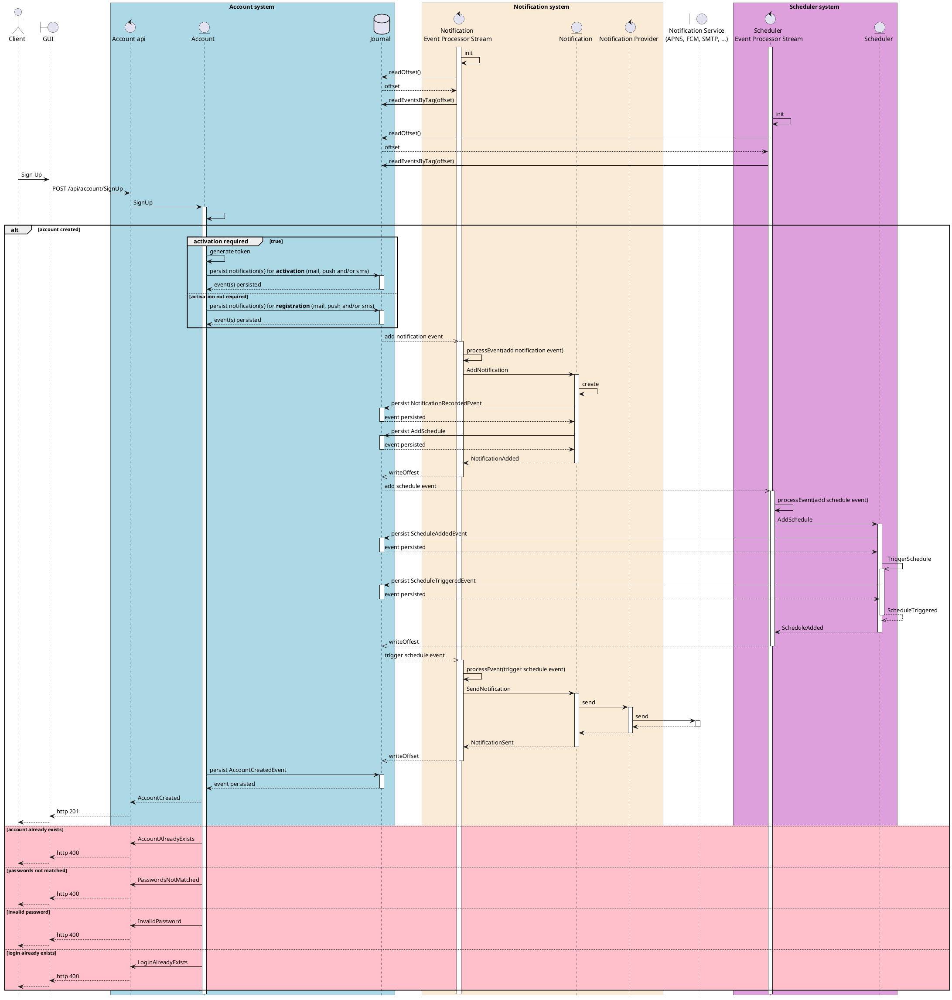

<!---
This file is auto-generate by a github hook please modify r.md if you don't want to loose your work
-->

# generic-account-api

```plantuml
@startuml SignUp
hide footbox

actor Client

boundary GUI as gui

box Account system #LightBlue
control "Account api" as api
entity Account
database "Journal" as journal
end box

box Notification system #AntiqueWhite
control "Notification \nEvent Processor Stream" as nps
entity Notification
control "Notification Provider" as np
end box

boundary "Notification Service\n(APNS, FCM, SMTP, ...)" as ns

box Scheduler system #Plum
control "Scheduler \nEvent Processor Stream" as sps
entity Scheduler
end box

activate nps
activate sps
nps -> nps: init
nps -> journal: readOffset()
journal --> nps: offset
nps -> journal: readEventsByTag(offset)

sps -> sps: init
sps -> journal: readOffset()
journal --> sps: offset
sps -> journal: readEventsByTag(offset)

Client -> gui: Sign Up
gui -> api: POST /api/account/SignUp
api -> Account: SignUp
activate Account

Account -> Account:

alt account created
    group activation required [true]
        Account -> Account: generate token
        Account -> journal++: persist notification(s) for **activation** (mail, push and/or sms)
        return event(s) persisted
        else activation not required
        Account -> journal++: persist notification(s) for **registration** (mail, push and/or sms)
        return event(s) persisted
    end

    journal -->> nps++: add notification event
    nps -> nps: processEvent(add notification event)
    nps -> Notification++: AddNotification
    Notification -> Notification: create
    Notification -> journal++: persist NotificationRecordedEvent
    return event persisted
    Notification -> journal++: persist AddSchedule
    return event persisted
    return NotificationAdded
    return writeOffest

    journal -->> sps++: add schedule event
    sps -> sps: processEvent(add schedule event)
        sps -> Scheduler++: AddSchedule
        Scheduler -> journal++: persist ScheduleAddedEvent
        return event persisted
            Scheduler ->> Scheduler++: TriggerSchedule
                Scheduler -> journal++: persist ScheduleTriggeredEvent
                return event persisted
            return ScheduleTriggered
        return ScheduleAdded
    return writeOffest

    journal -->> nps++: trigger schedule event
    nps -> nps : processEvent(trigger schedule event)
        nps -> Notification++: SendNotification
            Notification -> np++: send
                np -> ns++: send
                return
            return
        return NotificationSent
    return writeOffset

    Account -> journal++: persist AccountCreatedEvent
    return event persisted
    Account --> api: AccountCreated
    api --> gui: http 201
    gui --> Client

else #Pink account already exists
    Account -> api: AccountAlreadyExists
    api --> gui: http 400
    gui --> Client
else #Pink passwords not matched
    Account -> api : PasswordsNotMatched
    api --> gui: http 400
    gui --> Client
else #Pink invalid password
    Account -> api: InvalidPassword
    api --> gui: http 400
    gui --> Client
else #Pink login already exists
    Account -> api: LoginAlreadyExists
    api --> gui: http 400
    gui --> Client
end

@enduml
```